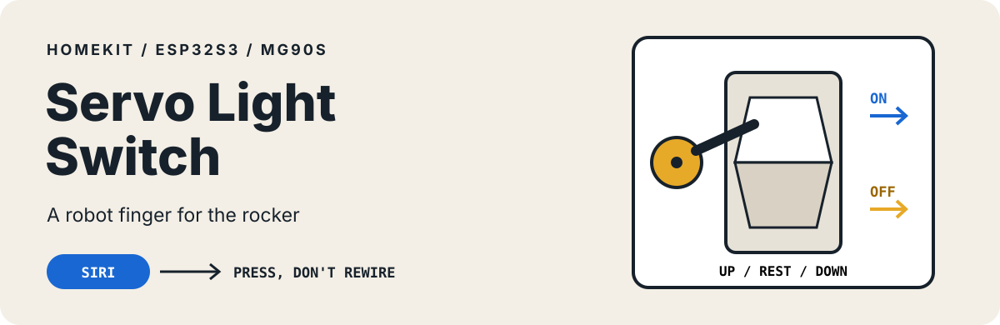

<p align="center">
  
</p>

<p align="center">
  <strong>Keep the switch. Add a robot finger.</strong><br>
  Siri talks to a XIAO ESP32S3; an MG90S servo presses the real rocker on or off.
</p>

> “Hey Siri, turn on the light.”

https://github.com/user-attachments/assets/30583818-0d01-4782-8400-2a43bfde717b

This is a small, intentionally mechanical HomeKit accessory. It does not replace mains wiring or hide a relay behind the wall. The servo moves the same switch you already use.

New to soldering? Start with **[SOLDERING.md](SOLDERING.md)**. The build needs only three board connections.

## Signal path

```text
Siri → Apple Home → HomeSpan on ESP32S3 → MG90S servo → rocker paddle
```

For every command, the servo leaves its neutral position, presses the appropriate half of the rocker, returns to center, and detaches so it does not buzz while idle.

## Parts

- Seeed Studio **XIAO ESP32S3** (the Sense version also works)
- **MG90S** micro servo
- USB-C wall power, at least 1 A; 2 A gives more headroom for servo current spikes
- Wire and a rigid mount beside the switch plate
- Optional 470–1000 µF electrolytic capacitor across servo 5 V and GND

Attach the XIAO’s external 2.4 GHz antenna. The Sense camera and microphone are not used.

## Wire three connections

| MG90S wire | XIAO ESP32S3 pad | Purpose |
| --- | --- | --- |
| Red | `5V` | Servo power |
| Brown | `GND` | Common ground |
| Orange | `D1` / GPIO2 | PWM signal |

The signal remains 3.3 V logic while the servo uses 5 V power. If you add an electrolytic capacitor, connect its striped negative leg to GND.

> The `D1` pad is GPIO2 on the ESP32S3. It was GPIO3 on the older XIAO ESP32C3, so do not copy the old pin number.

## Mount the mechanism

```text
             servo arm
                  │
          ┌───────▼───────┐
ON   ◀────│       ▲       │  press the top half
          │ ─── neutral ─ │  rest clear of the paddle
OFF  ◀────│       ▼       │  press the bottom half
          └───────────────┘
```

Place the servo pivot roughly level with the middle of the rocker. The horn must reach both halves while clearing the paddle at the rest angle. Use a rigid bracket, strong foam tape, or mounting strips so the arm has enough leverage.

## Flash and pair

### Arduino setup

Install:

- ESP32 board package 3.0.0 or later
- [`ESP32Servo`](https://github.com/madhephaestus/ESP32Servo)
- [`HomeSpan`](https://github.com/HomeSpan/HomeSpan)

Open `servo-light-switch/servo-light-switch.ino` and use these board settings:

| Setting | Value |
| --- | --- |
| Board | `XIAO_ESP32S3` |
| USB CDC On Boot | Enabled |
| PSRAM | OPI PSRAM |
| Partition scheme | Default |

If the board does not appear for flashing, hold **BOOT**, tap **RESET**, then release **BOOT**.

### First pairing

1. Flash the sketch.
2. Open Serial Monitor at `115200` baud with newline endings.
3. Enter `W` and follow HomeSpan’s prompts for a 2.4 GHz Wi-Fi network.
4. In the iPhone Home app, choose **Add Accessory** and select **Wall Light**.
5. Enter HomeSpan’s displayed setup code. The default is `466-37-726`.

The Home app may label a DIY HomeSpan accessory as uncertified.

## Calibrate the press

Tune the geometry constants near the top of the sketch:

| Constant | Default | Role |
| --- | ---: | --- |
| `SERVO_REST_ANGLE` | 90° | clears both halves |
| `SERVO_ON_ANGLE` | 130° | presses the top half |
| `SERVO_OFF_ANGLE` | 50° | presses the bottom half |
| `PRESS_HOLD_MS` | 250 ms | holds the paddle |
| `SERVO_PIN` | GPIO2 | `D1` on the XIAO |

Find a clear rest position first. Move the on/off angles outward only until the switch flips cleanly. If the servo stalls, slams, or buzzes against the paddle, move that angle back toward rest.

If Siri’s on and off directions are reversed, swap `SERVO_ON_ANGLE` and `SERVO_OFF_ANGLE`.

## Behavior and limits

- HomeKit’s last commanded state is stored in NVS and survives a reboot.
- Repeating a command is safe: the arm simply presses the same side again.
- The board reboots after Wi-Fi has been unavailable for 60 seconds.
- There is no sensor on the physical rocker. If someone flips it by hand, HomeKit cannot detect the change; send the opposite command or toggle twice to resynchronize.

This is a low-voltage add-on mounted outside the wall plate. Do not open or modify mains wiring for this build.
